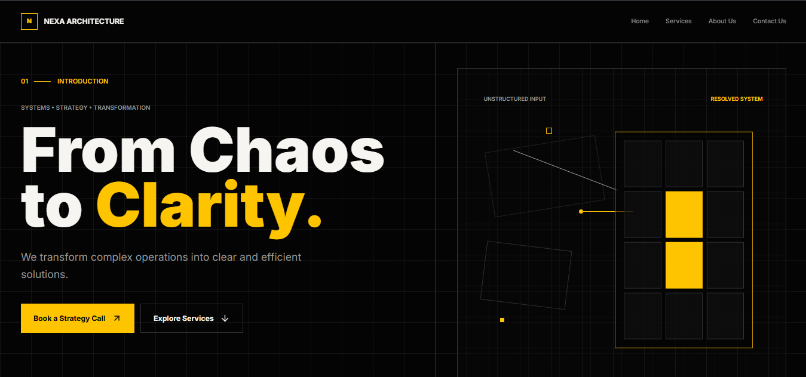

# Nexa Architecture

A dark, technical landing page for **Nexa Architecture** — a fictional consulting studio focused on system architecture, digital transformation, and technical strategy.

[Live Demo](https://nexa-architecture.vercel.app/)



## Features

- Single-page layout with sticky navigation
- Responsive design (mobile menu + desktop nav)
- Shared section labels and navigation data
- CSS-only technical diagrams (no images or canvas)
- Semantic markup and basic accessibility
- Static site — no backend or API


## Tech Stack

- [Angular](https://angular.dev/) 21 (standalone components)
- [Tailwind CSS](https://tailwindcss.com/) 4
- [Lucide Angular](https://lucide.dev/)
- TypeScript

## Getting Started

```bash
npm install
npm start
```

Open [http://localhost:4200/](http://localhost:4200/).

```bash
npm run build
```
